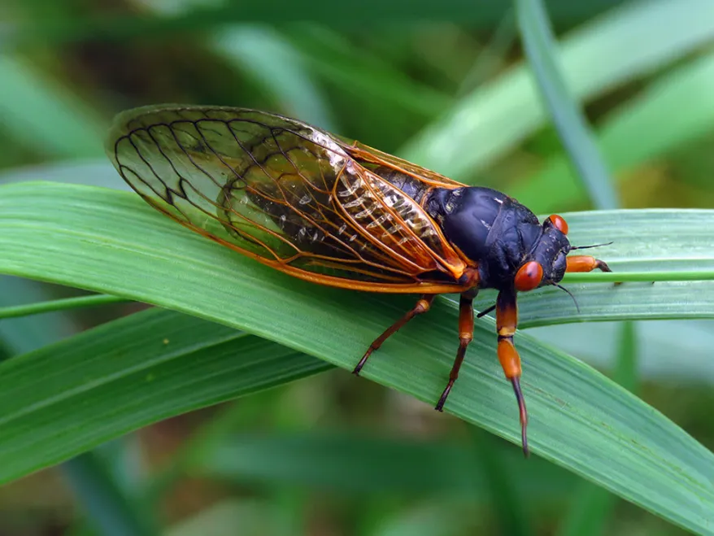
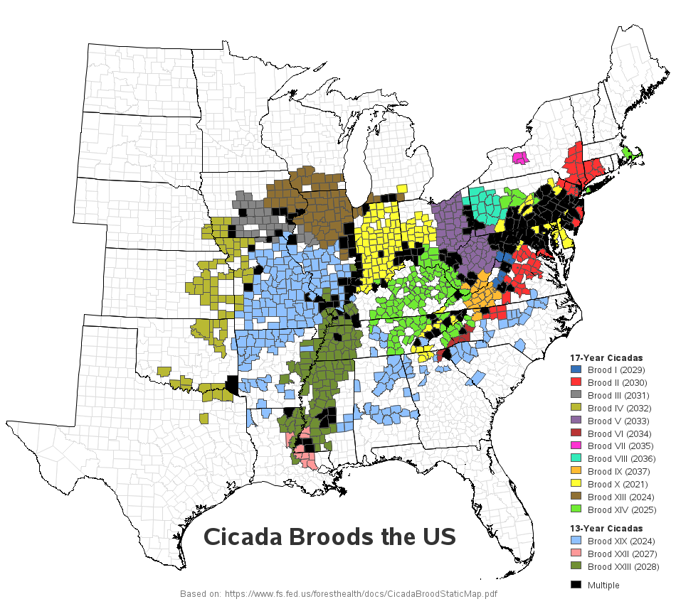
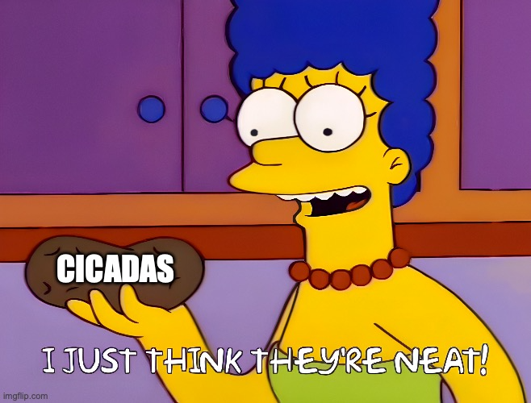

```{r setup, include=FALSE}
knitr::opts_chunk$set(echo = FALSE)
options(repos = c(CRAN = "https://cran.r-project.org"))
```

## Background

Cicadas are a superfamily of insects that are noteable for their cyclic emergence and distinct mating calls. Cicada species found in Eastern North America emerge in intervals of 13 to 17 years, depending on the species. Other species of cicada found in other parts of the world emerge on an annual basis.

```{r, echo = FALSE, fig.align='center'}

```

<div style="text-align: center;">
*A Brood X cicada lounges on a leaf.*
</div>

## Background

In recent years, emergence has been found to be ahead of schedule, suggesting that environmental factors that may signal for emergence are changing, possibly due to a warming climate. 

```{r, echo = FALSE, fig.align='center', out.width="60%"}

```

## Cicada Data Set

The chosen dataset contains wing and body measurements of 3 distinct cicada species:

- *Cryptotympana atrata*
- *Meimuna mongolica*
- *Platypleura kaempferi*

These species are annual cicadas typically found in Eastern and Southeastern Asia. The three species in this dataset share geographic similarity, so I am interested to see any correlations that can be found in their morphology.

The data was accessed from the following site:
https://datadryad.org/stash/dataset/doi:10.5061/dryad.4xgxd25bg

## Why did I choose a cicada data set?

I don't study cicadas in my academic research. So why did I pick this subject? 

Firstly, the dataset was appealing from a data analysis perspective. There are lots of things I can do to rearrange the data to become useful. 

Secondly, this dataset intrigued me because I had previously only known about periodical cicadas (I lived in the DC area in 2021, and experienced the emergence of the Great Eastern Brood). 

And thirdly, and quite simply...

## Why did I choose a cicada data set?

```{r, echo = FALSE, fig.align='center', out.width="80%"}

```

## Reading in my data

The first step after uploading the dataset to my github repository as a .csv file was to read it into RStudio.

```{r, echo = TRUE}

#read in data as a csv file
cicada_data <- read.csv("https://raw.githubusercontent.com/sbelblidia/Biostats_2023/main/CicadaData.csv")

```

## Parsing out the "Code" column

Column 2 is a list of codes assigned to each observation. Upon reading the ReadMe file that was included with the dataset, I learned that the code corresponds to several types of information that I could better understand if they were separated into their own variables. See ReadMe excerpt below:

The second column, “Code”, is used to show the individual wing information.
X-XXX-XXX

- The X before the first hyphen is the species code: “1” represents CA, “2” represents MM, and “3” represents “PK”.

- The XXX between two hyphens represents the individual cicada number.

- After the second hyphen, there are three X’s. The first one represents a male (denoted by “1”) or a female (denotes by “2”); the second one represents a forewing (denoted by “1”) or a hindwing (denoted by “2”); the third one represents the left wing (denoted by “1”) or the right wing (denoted by “2”) from a top view.

## Parsing out the "Code" column

Using tidyr, I separated the "Code" column into 3 separate columns: "species", "individual", and "sex_wing".

```{r, echo = TRUE}

#install and load tidyr
install.packages("tidyr")
library(tidyr)

#separate "code" into new variables
cicada_data <- separate(cicada_data, col = Code, into = c("species", "individual", "sex_wing"), sep = "-")

```

## Parsing out the "Code" column

I then further separated "sex_wing" into "sex", "fore_or_hind", and "left_or_right" using dplyr and tidyr.

```{r, echo = TRUE}

#install and load dplyr
install.packages("dplyr")
library(dplyr)

#separating the first, second, and third digits in "sex_wing" by hyphens
cicada_data <- cicada_data %>% 
  mutate(sex_wing = gsub("(\\d)(\\d)(\\d)", "\\1-\\2-\\3", sex_wing))

#separate "sex_wing" into new variables
library(tidyr)
cicada_data <- separate(cicada_data, col = sex_wing, into = c("sex", "fore_or_hind", "left_or_right"), sep = "-")

```

## Reformatting "species" column

The "species" column has numbers assigned to each species. I wanted to change them to the actual species name so that each observation is more easily distinguishable. From the ReadMe file, the assignments are as follows:

- 1 = CA
- 2 = MM
- 3 = PK


```{r, echo = TRUE}

#use ifelse to reassign the values in the column to match the species
cicada_data$species <- ifelse(
  cicada_data$species == "1", "CA",
  ifelse(cicada_data$species == "2", "MM",
  ifelse(cicada_data$species == "3", "PK",
  cicada_data$species)))

```

## Reformatting sex and wing columns

I ran a similar code chunk to clearly label the sex column as male or female, and the two wing type columns as fore/hind and left/right. This was to help me easily create subsets that I wanted to look at in my data visualizations.

```{r, echo = TRUE}

#use ifelse to reassign the values in the column to match what was in the readme
cicada_data$sex <- ifelse(
  cicada_data$sex == "1", "m",
  ifelse(cicada_data$sex == "2", "f",
  cicada_data$sex))
cicada_data$fore_or_hind <- ifelse(
  cicada_data$fore_or_hind == "1", "fore",
  ifelse(cicada_data$fore_or_hind == "2", "hind",
  cicada_data$fore_or_hind))
cicada_data$left_or_right <- ifelse(
  cicada_data$left_or_right == "1", "left",
  ifelse(cicada_data$left_or_right == "2", "right",
  cicada_data$left_or_right))

```

## Renaming variables

With 5 new variables to analyze from the original "Code" variable, I wanted to finish formatting the other variable names to ones that I want to work with. This step would make coding more intuitive for me later on in my data analysis.

```{r, echo = TRUE}

#use rename() to rename columns
library(dplyr)
cicada_data <- rename(cicada_data, "date" = Time, "data_points" = N, "wing_length" = WL, "wing_width" = WW, "wing_area" = WA, "body_mass" = BM, "body_length" = BL, "eye_dist" = ED)

#check column names
names(cicada_data)

```

## Removing "data points" column

The "data points" column was unnecessary for my analysis. It was used by the original researchers to calculate wing area for each sample. Because wing area is included in the data set, I removed "data points" from the set using indexing.

```{r, echo = TRUE}

#remove the 7th column from the dataset
cicada_data <- cicada_data[,-7]
#check the dataset to make sure the correct column was removed
head(cicada_data)

```

## Checking my data types

I wanted to make sure that the necessary variables are stored as the data type that I needed. "species", "sex", "fore_or_hind", and "left_or_right" should be in factor format for future filtering steps. All body and wing measurements should be numeric.

```{r, echo = TRUE}

#use class() to check that measurements are stored as numeric
class(cicada_data$wing_area)

#check non-numeric data
class(cicada_data$species)

```

"species", "sex", "fore_or_hind", and "left_to_right" had been stored as characters. I converted them to factors.

```{r, echo = TRUE}

#use factor() to change the needed data types
cicada_data$species <- factor(cicada_data$species)
cicada_data$sex <- factor(cicada_data$sex)
cicada_data$fore_or_hind <- factor(cicada_data$fore_or_hind)
cicada_data$left_or_right <- factor(cicada_data$left_or_right)

```

## Hypothesis # 1: Correlation between body size and loudness

I first wanted to look into the data to find correlations between the morphologies of the different species and sexes and the ability to produce sound. Male cicadas create their calling sound by expanding and contracting an organ in their abdomen called the tymbal.

The following are the calling sounds of species of the same genus as those in my dataset:

*Cryptotympana*

<audio controls>
  <source src="cryptotympana.s003.wav" type="audio/wav">
</audio>

*Meimuna*

<audio controls>
  <source src="meimuna.s013.wav" type="audio/wav">
</audio>

*Platypleura*

<audio controls>
  <source src="platypleura.s006.wav" type="audio/wav">
</audio>

I hypothesize, based on the volume and complexity of the calling sounds of the different genera, that <u>Meimuna mongolica will have the largest abdomen and therefore the largest body measurements</u>. Conversely, I hypothesize that <u>Platypleura kaempferi will have the smallest body measurements</u>.

## Hypothesis # 1: Correlation between body size and loudness

First, I created a new variable for the ratio between body mass and body length.

```{r, echo = TRUE}
#create a new variable for the ratio between body mass and length
library(dplyr)
cicada_data <- cicada_data %>% mutate(body_mass/body_length)

```

## Hypothesis # 1: Correlation between body size and loudness

Then, I plotted the full dataset on histograms to look at body mass, body length, and mass/length.

```{r, echo = TRUE}

#make histograms for body mass, body length, and mass:length ratio
par(mfrow = c(1,3))
hist(cicada_data$body_mass, main = "Body Mass", col = "red")
hist(cicada_data$body_length, main = "Body Length", col = "blue")
hist(cicada_data$`body_mass/body_length`, main = "Mass/Length", col = "green")

```


## Hypothesis # 1: Correlation between body size and loudness

The data looked skewed, and I suspected it was due to the three species being lumped together. Using QQPlot, I verified that my data was skewed.

```{r, echo = TRUE}
#put 3 graphs next to each other
par(mfrow = c(1,3))

#qqplot for body mass
qqnorm(cicada_data$body_mass, main = "Body Mass")
#add qqline for reference
qqline(cicada_data$body_mass)

#qqplot for body length
qqnorm(cicada_data$body_length, main = "Body Length")
#add qqline for reference
qqline(cicada_data$body_length)

#qqplot for mass/length
qqnorm(cicada_data$`body_mass/body_length`, main = "Mass/Length")
#add qqline for reference
qqline(cicada_data$`body_mass/body_length`)

```


## Hypothesis # 1: Correlation between body size and loudness


So I filtered the data by species and then created separate histograms.

```{r, echo = TRUE}

#filter dataset by species
ca_cicadas <- filter(cicada_data, species == "CA")
mm_cicadas <- filter(cicada_data, species == "MM")
pk_cicadas <- filter(cicada_data, species == "PK")

#make a 3x3 grid of graphs
par(mfrow = c(3,3))

#make species-specific histograms
hist(ca_cicadas$body_mass, main = "CA", xlab = "mass (g)", ylab = "Freq.", col = "red")
hist(mm_cicadas$body_mass, main = "MM", xlab = "mass (g)", ylab = "Freq.", col = "red")
hist(pk_cicadas$body_mass, main = "PK", xlab = "mass (g)", ylab = "Freq.", col = "red")

hist(ca_cicadas$body_length, main = "", xlab = "length (cm)", ylab = "Freq.", col = "blue")
hist(mm_cicadas$body_length, main = "", xlab = "length (cm)", ylab = "Freq.", col = "blue")
hist(pk_cicadas$body_length, main = "", xlab = "length (cm)", ylab = "Freq.", col = "blue")

hist(ca_cicadas$`body_mass/body_length`, main = "", xlab = "mass/length (g/cm)", ylab = "Freq.", col = "green")
hist(mm_cicadas$`body_mass/body_length`, main = "", xlab = "mass/length (g/cm)", ylab = "Freq.", col = "green")
hist(pk_cicadas$`body_mass/body_length`, main = "", xlab = "mass/length (g/cm)", ylab = "Freq.", col = "green")

```

## Hypothesis # 1: Correlation between body size and loudness

Sure enought, qqplots of the species-specific datasets yielded more normal distributions.

```{r, echo = TRUE}

#make a 3x3 grid of plots
par(mfrow = c(3,3))

#species-specific qqplots for body mass

qqnorm(ca_cicadas$body_mass, main = "CA Body Mass")
#add qqline for reference
qqline(ca_cicadas$body_mass)

qqnorm(mm_cicadas$body_mass, main = "MM Body Mass")
#add qqline for reference
qqline(mm_cicadas$body_mass)

qqnorm(pk_cicadas$body_mass, main = "PK Body Mass")
#add qqline for reference
qqline(pk_cicadas$body_mass)


#species-specific qqplot for body length

qqnorm(ca_cicadas$body_length, main = "CA Body Length")
#add qqline for reference
qqline(ca_cicadas$body_length)

qqnorm(mm_cicadas$body_length, main = "MM Body Length")
#add qqline for reference
qqline(mm_cicadas$body_length)

qqnorm(pk_cicadas$body_length, main = "PK Body Length")
#add qqline for reference
qqline(pk_cicadas$body_length)


#species-specific qqplot for mass/length

qqnorm(ca_cicadas$`body_mass/body_length`, main = "CA Mass/Length")
#add qqline for reference
qqline(ca_cicadas$`body_mass/body_length`)

qqnorm(mm_cicadas$`body_mass/body_length`, main = "MM Mass/Length")
#add qqline for reference
qqline(mm_cicadas$`body_mass/body_length`)

qqnorm(pk_cicadas$`body_mass/body_length`, main = "PK Mass/Length")
#add qqline for reference
qqline(pk_cicadas$`body_mass/body_length`)

```

## Hypothesis # 1: Correlation between body size and loudness

Calculating the mean and median values for each variable:

```{r, echo = TRUE}
#find the mean body mass of each species
ca_mean_mass <- mean(ca_cicadas$body_mass)
mm_mean_mass <- mean(mm_cicadas$body_mass)
pk_mean_mass <- mean(pk_cicadas$body_mass)

#print mean values
cat("CA Mean Mass:", ca_mean_mass, "\n")
cat("MM Mean Mass:", mm_mean_mass, "\n")
cat("PK Mean Mass:", pk_mean_mass, "\n")

#find the median body mass of each species
ca_med_mass <- median(ca_cicadas$body_mass)
mm_med_mass <- median(mm_cicadas$body_mass)
pk_med_mass <- median(pk_cicadas$body_mass)

#print median values
cat("CA Median Mass:", ca_med_mass, "\n")
cat("MM Median Mass:", mm_med_mass, "\n")
cat("PK Median Mass:", pk_med_mass, "\n")

#find the mean body length of each species
ca_mean_length <- mean(ca_cicadas$body_length)
mm_mean_length <- mean(mm_cicadas$body_length)
pk_mean_length <- mean(pk_cicadas$body_length)

#print the mean values
cat("CA Mean Length:", ca_mean_length, "\n")
cat("MM Mean Length:", mm_mean_length, "\n")
cat("PK Mean Length:", pk_mean_length, "\n")

#find the median body length of each species
ca_med_length <- median(ca_cicadas$body_length)
mm_med_length <- median(mm_cicadas$body_length)
pk_med_length <- median(pk_cicadas$body_length)

#print the median values
cat("CA Median Length:", ca_med_length, "\n")
cat("MM Median Length:", mm_med_length, "\n")
cat("PK Median Length:", pk_med_length, "\n")

#find the mean mass/length ratio of each species
ca_mean_ml_ratio <- mean(ca_cicadas$`body_mass/body_length`)
mm_mean_ml_ratio <- mean(mm_cicadas$`body_mass/body_length`)
pk_mean_ml_ratio <- mean(pk_cicadas$`body_mass/body_length`)

#print the mean values
cat("CA Mean Mass/Length:", ca_mean_ml_ratio, "\n")
cat("MM Mean Mass/Length:", mm_mean_ml_ratio, "\n")
cat("PK Mean Mass/Length:", pk_mean_ml_ratio, "\n")

#find the median mass/length ratio of each species
ca_med_ml_ratio <- median(ca_cicadas$`body_mass/body_length`)
mm_med_ml_ratio <- median(mm_cicadas$`body_mass/body_length`)
pk_med_ml_ratio <- median(pk_cicadas$`body_mass/body_length`)

#print the median values
cat("CA Median Mass/Length:", ca_med_ml_ratio, "\n")
cat("MM Median Mass/Length:", mm_med_ml_ratio, "\n")
cat("PK Median Mass/Length:", pk_med_ml_ratio, "\n")

```

## Hypothesis # 2: Correlation between body size and sex

Because the tymbal is found in the abdomen of the male cicada, I hypothesize that the abdomens of female cicadas will, on average, be smaller than that of their male counterparts. Thus, <u>I hypothesize that female cicadas will have smaller body measurements than males</u>.

## Hypothesis # 2: Correlation between body size and sex

Plotting body mass, body length, and mass/length ratio by sex showed many outliers.

```{r, echo = TRUE}

install.packages("ggplot2")
library(ggplot2)

install.packages("ggpubr")
library(ggpubr)

ggplot(cicada_data, aes(x = sex, y = body_mass, fill = sex)) +
  geom_boxplot(notch = TRUE)

ggplot(cicada_data, aes(x = sex, y = body_length, fill = sex)) +
  geom_boxplot(notch = TRUE)

ggplot(cicada_data, aes(x = sex, y = body_mass/body_length, fill = sex)) +
  geom_boxplot(notch = TRUE)

```

## Hypothesis # 2: Correlation between body size and sex

Separating the plots by species:

```{r, echo = TRUE}

ggplot(ca_cicadas, aes(x = sex, y = body_mass, fill = sex)) +
  geom_boxplot(notch = TRUE) +
  ggtitle("Cryptotympana atrata") +
  theme(plot.title = element_text(hjust = 0.5))

ggplot(mm_cicadas, aes(x = sex, y = body_mass, fill = sex)) +
  geom_boxplot(notch = TRUE) +
  ggtitle("Meimuna mongolica") +
  theme(plot.title = element_text(hjust = 0.5))

ggplot(pk_cicadas, aes(x = sex, y = body_mass, fill = sex)) +
  geom_boxplot(notch = TRUE) +
  ggtitle("Platypleura kaempferi") +
  theme(plot.title = element_text(hjust = 0.5))

ggplot(ca_cicadas, aes(x = sex, y = body_length, fill = sex)) +
  geom_boxplot(notch = TRUE) +
  ggtitle("Cryptotympana atrata") +
  theme(plot.title = element_text(hjust = 0.5))

ggplot(mm_cicadas, aes(x = sex, y = body_length, fill = sex)) +
  geom_boxplot(notch = TRUE) +
  ggtitle("Meimuna mongolica") +
  theme(plot.title = element_text(hjust = 0.5))

ggplot(pk_cicadas, aes(x = sex, y = body_length, fill = sex)) +
  geom_boxplot(notch = TRUE) +
  ggtitle("Platypleura kaempferi") +
  theme(plot.title = element_text(hjust = 0.5))

ggplot(ca_cicadas, aes(x = sex, y = body_mass/body_length, fill = sex)) +
  geom_boxplot(notch = TRUE) +
  ggtitle("Cryptotympana atrata") +
  theme(plot.title = element_text(hjust = 0.5))

ggplot(ca_cicadas, aes(x = sex, y = body_mass/body_length, fill = sex)) +
  geom_boxplot(notch = TRUE) +
  ggtitle("Meimuna mongolica") +
  theme(plot.title = element_text(hjust = 0.5))

ggplot(ca_cicadas, aes(x = sex, y = body_mass/body_length, fill = sex)) +
  geom_boxplot(notch = TRUE) +
  ggtitle("Platypleura kaempferi") +
  theme(plot.title = element_text(hjust = 0.5))

```

## Hypothesis # 3: Correlation between wing size and sex

I then wanted to look at the wing measurements gathered in the dataset to understand a little more about how wing size differs between sexes. In many other animal species (such as birds), wings are larger and more ornate so as to attract their mate. 

<u>I hypothesize that males will have larger wings than their female counterparts</u>.

## Hypothesis # 3: Correlation between wing size and sex

Plotting wing sizes showed that the data points clustered into distinct groups, but sex did not seem to be a factor.

```{r, echo = TRUE}
#make a scatter plot of wing length vs wing width, with small translucent dots, categorized. by sex
ggplot(cicada_data, aes(x = wing_length, y = wing_width, color = sex)) +
  geom_point(size = 0.7, alpha = 0.5) +
  labs(title = "Wing Sizes by Sex", x = "wing length (cm)", y = "wing windth (cm)") +
  theme(plot.title = element_text(hjust = 0.5))

```

## Hypothesis # 3: Correlation between wing size and sex

Distinguishing between fore/hind wings and right/left wings showed some clustering patterns for fore/hind, but not left/right.

```{r, echo = TRUE}

ggplot(cicada_data, aes(x = wing_length, y = wing_width, color = fore_or_hind, shape = left_or_right)) +
  geom_point(size = 1, alpha = 0.5) +
  labs(title = "Wing Sizes by Anatomy", x = "wing length (cm)", y = "wing windth (cm)") +
  theme(plot.title = element_text(hjust = 0.5))

```

## Hypothesis # 3: Correlation between wing size and sex

Finally, separating the sizes by species showed that wing size was indeed dependent on both species and whether the wing is a forewing or a hindwing.

```{r, echo = TRUE}

ggplot(cicada_data, aes(x = wing_length, y = wing_width, color = species, shape = fore_or_hind)) +
  geom_point(size = 1, alpha = 0.5) +
  labs(title = "Wing Sizes by Species", x = "wing length (cm)", y = "wing windth (cm)") +
  theme(plot.title = element_text(hjust = 0.5))

#running anova
aov(wing_length ~ wing_width, data = cicada_data)

```

## Conclusions

*Hypothesis #1*

Based on the mean and median values of body mass, body length, and the ratio of body mass to body length, Cryptotympana atrata was the largest species of the data set. Platypleura kaempferi is the smallest. Therefore, the first half of my first hypothesis was incorrect, while the second half was correct.

*Hypothesis #2*

Based on the box plots of each species, female cicadas across the board were larger than males. Therefore, my second hypothesis was incorrect.

*Hypothesis #3*

Wing size clustered by species and forewing/hindwing. There was no discernable difference due to sex. Therefore, my third hypothesis was incorrect.

## Future directions

Interesting future directions for this dataset could be:

- Incorporating GIS data to overlay sampling locations

- incorporate average decibel levels for each cicada

- look at other aspects of wing morphology, such as coloration
